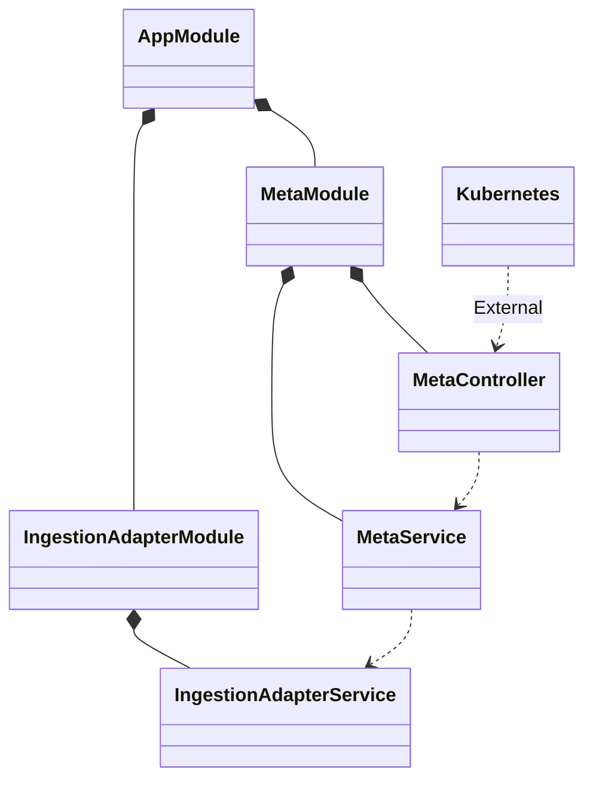

# Secret Request Controller

A secret request metacontroller hook that handles requests for secrets from within the kubernetes cluster

## Key Systems

### NestJS Structure



### Environment Variables

| Environment Variable   | Description                             |   Type   | Default Value    | Required |
|------------------------|-----------------------------------------|:--------:|------------------|:--------:|
| PORT                   | The port the service will listen on     | `number` | `3000`           |          |

## Metrics

Prometheus metrics are exposed on the `/metrics` endpoint

## More Information

- [Backend](https://backstage.flowcore.io/catalog/default/group/backend)

# Development

To start using the project just configure it using:

## Configuration

```bash
yarn install && git submodule update --init --recursive
git submodule add --force git@github.com:flowcore-io/the-source-message-schema.git src/assets/messages
yarn reconfigure
yarn generate:domain source
```

## Testing

local testing requires a local kubernetes cluster to be running, this can be done using kind

```bash
brew install kind
kind create cluster --name local
```


## Usage

run with:

```bash
yarn start
```

if tests require ECR containers to be running, run:

```bash
yarn login:ecr
```