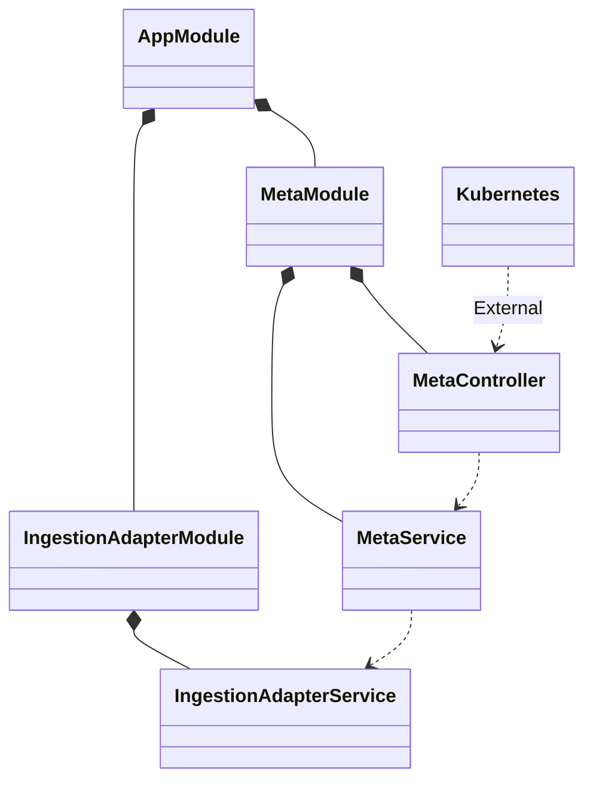

# Secret Request Controller

A secret request [metacontroller](https://metacontroller.github.io/metacontroller/intro.html) hook that handles requests for secrets from within the kubernetes cluster

## Key Systems

### NestJS Structure



### Environment Variables

| Environment Variable   | Description                             |   Type   | Default Value    | Required |
|------------------------|-----------------------------------------|:--------:|------------------|:--------:|
| PORT                   | The port the service will listen on     | `number` | `3000`           |          |

## Installation

To install the [metacontroller](https://metacontroller.github.io/metacontroller/intro.html) on your own environment you first need to install metacontroller using helm

example values file:

```yaml
replicas: 2
commandArgs:
  - --zap-log-level=4
  - --discovery-interval=20s
  - --leader-election=true
  - --workers=10
```

```bash
helm install <name> oci://ghcr.io/metacontroller/metacontroller-helm --version=4.11.12 --values ./values.yaml
```

then install the controller

```bash
export NAMESPACE=<<my-namespace>>; curl -s https://raw.githubusercontent.com/flowcore-io/service-core-secret-request-controller/main/crd/metacontroller-controller.yaml | sed "s/<<namespace>>/$NAMESPACE/g" | kubectl apply -n $NAMESPACE -f -
```

This will install the controller and the crds required to run the controller.

## Usage

To use the controller you need to create a secret request object, they look like this and are cluster scoped:

```yaml
apiVersion: flowcore.io/v1
kind: SecretRequest
metadata:
  name: my-secret-request
spec:
  sourceSecret:
    name: source-secret-name
    namespace: source-secret-namespace
  destinationSecret:
    name: destination-secret-name
    namespace: destination-secret-namespace
```

## Development

To start using the project just configure it using:

### Configuration

```bash
yarn install
yarn reconfigure
```

### Testing

local testing requires a local kubernetes cluster to be running, this can be done using kind

```bash
brew install kind
kind create cluster --name local
```

### Run

run with:

```bash
yarn start
```
